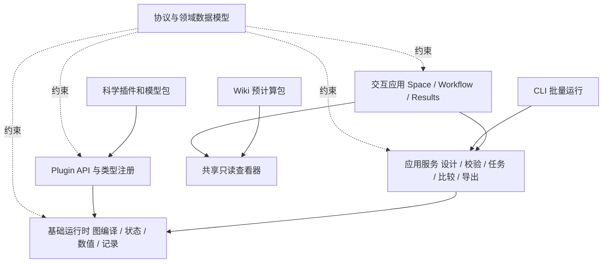

# 架构、状态与文件结构

状态：2026-09-29 目标结构，2026-10-01 补充实施状态。本文记录现有实现与目标结构，不要求为配合目录图搬移源码。架构继续使用 Python/NumPy、ES modules 与 Three.js；下文分层及目标目录不等于当前物理文件布局。

2026-10-01 实施注记：注册目录、异步任务 worker/SQLite 存储、固定 PTS 和空间执行器已分别落在 `registry.py`、`tasks/` 与 `engine/`。M4 增加 `engine/checkpoint_io.py` 和 `checkpoint.py` 的独立文件/CLI 入口，外层文件 0.1.0 包装冻结 Project 0.4 与内部 `spatial-checkpoint/v2`。当前没有通用 `application/`、`server/` 或 `plugin_api/` 层；图中的职责划分仍是演进目标。

执行合同按 profile 分开：legacy 为 Project 0.1/0.2、Catalog/Task 0.1；固定 PTS 为 Project 0.3、Catalog/Task 0.2；空间为 Project 0.4、Catalog/Task 0.3。M4 不改变任务状态机，任务 pause/resume 和运行中环境迁移仍在 N7；空间 profile 不支持生长、分裂、死亡或外部 controls。实际状态见[空间合同](../protocol/spatial-profile.md)和[checkpoint 文件](../checkpoint-files.md)。

科学执行器现由 `engine/chemotaxis_*`、`hazard_walk.py`、`observations.py` 与 `science/chemotaxis.py`、`physiology.py`、`materials.py` 组成，前端模板和指标使用 `templates.mjs`、`metrics.mjs`、`metric-results.mjs`。它们共同实现[科学 profile](../protocol/chemotaxis-profile.md)，不改旧 profile 的科学含义。

## 1. 四类职责及依赖



协议是跨层共同规则，不能替代执行器、调度器或物理模型。基础层含平台能力与可替换基础数值算子，两者分别归档：数值求解方法的变化不能藏在 UI 或文件加载器中。插件实现合同，核心不 import 某个项目专用科学包；应用服务负责把目标、候选、图与计算组织成完整用户任务。

## 2. 领域实体

| 实体 | 保存内容 | 不承担的职责 |
| --- | --- | --- |
| DesignBrief | 指标、区域/时间、硬约束、软目标、对照、可变参数 | 不自动生成物理事实或校准数据 |
| DesignCandidate | 设计方案、底盘/元件配置、证据引用、参数覆盖 | 不以一次随机运行代表优劣 |
| ExperimentSpec | 场地、初始化、作用机制图、输入日程、观察计划 | 不保存相机或面板位置 |
| WorkspaceDraft | 可编辑方案、未完成图、模板绑定、编辑修订 | 不持有可变的运行状态 |
| ViewState | 相机、图布局、选中对象、面板与语言 | 不影响科学输入 hash |
| RegistrySnapshot | 已解析的类型、模块、实现、参数包和依赖版本 | 不自动实例化全部条目 |
| CompiledPlan | 排序、状态分配、显式转换、后端选择、时间积分策略 | 不更改提交的图与参数 |
| RunSubmission / Run | 不可变输入、执行设置、任务状态、结果引用 | 不回写正在编辑的草稿 |
| Result / Report | 已提交帧、指标、事件、日志、来源和完整性 | 不自行推算缺失的科学结果 |

以上是领域职责目标，并非已逐项发布的数据类型。当前 Project、Workspace、CompiledPlan、任务 frozen input 和 Result 承担其中已实现的部分；DesignBrief/DesignCandidate、通用参数包依赖解析和报告体系仍需后续合同。第一版把 ExperimentSpec 嵌在单一项目文档中即可，不必为了名字拆成多个服务或数据库。稳定 ID 和明确引用先于文件拆分。

## 3. 注册目录分工

- `species`：物质身份、外部标识和带条件的属性；同一物质可被多个机制引用，避免按“引诱物/营养物”复制为不同身份。
- `entity_types`：可放置的菌群、源、底物表面、障碍、观察区域及初始化合同。
- `field_types`：标量/向量、体场/表面场、物种、单位、网格/坐标定义；登记不等于分配场。
- `modules`：输入输出、公式/算法、参数、状态读写、计算实现和生命周期。
- `parameter_sets`、`chassis`、`parts`：带来源、适用条件和不确定性的数据，独立于执行代码。
- `templates`、`model_packs`：对象和图的组合配方、依赖锁定及示例；科学包可以同时贡献多种登记项。
- `exporters`：目标格式、支持的语义子集、损失说明、验证器和回读能力。

UI 通过 schema 生成普通属性编辑器，通过受控 renderer key 选择胶囊、盒、点源、网格等显示方式。插件清单不包含能直接执行的 HTML/JavaScript。新几何若超出内置渲染器，先显示明确占位；可扩展 UI 需要单独受信任的发布与兼容机制。

## 4. 前后端各自拥有的状态

| 状态 | 所有者 / 唯一更新路径 |
| --- | --- |
| 用户可编辑输入 | 前端 document store，经 command/transaction 更新 |
| 相机、选择与面板 | 前端 view store；不参与科学版本变化 |
| 程序运行状态 | 服务端任务存储；前端仅缓存和查询 |
| 位置/朝向 | 声明的运动算子提出更新，空间约束协调后原子提交 |
| 几何与分裂 | 生长/分裂算子提出更新，由生命周期协调器提交 |
| 物种库存/浓度 | 单一场更新器接受多个速率贡献并统一结算 |
| 受体/酶/能量等内部状态 | 明确的模块 owner；死亡/分裂/迁移遵守各自策略 |
| 历史结果 | 记录器只追加已提交状态；完成后按 manifest 发布 |

插件拿到只读 StepContext 和受控的输出/状态提案接口，不直接改共享数组。一个状态一个提交所有者；多个源/汇可以通过声明的合并器贡献速率，不能依赖插件执行先后次序覆盖彼此。

群组 ID、细胞 ID 与数组索引分离。出生、分裂、死亡、筛选或并行重排之后必须重新建立 ID 到行的映射；端口绑定按 entity set 对齐，不能仅凭数组长度相同就相连。

## 5. 建议的渐进式目录

以下是目标目录图。`engine/`、`protocol/`、`web/` 保留当前位置，减少迁移成本；仅在对应实现进入时创建具体目录与文件。

```text
friskoli-cad/
├── README.md / PROGRESS.md / CONTRIBUTING.md
├── docs/
│   ├── design/                       # 本设计集与后续决策
│   ├── ...当前版本协议说明...
│   └── validation/                   # 科学对照、数值与设备验收记录
├── src/friskoli_cad/
│   ├── protocol/
│   │   ├── schemas/                  # 按格式族、版本保留现有 Schema
│   │   ├── validation.py             # 兼容入口，逐项下放验证
│   │   ├── diagnostics.py / units.py
│   │   └── migrations/               # 纯数据转换和损失报告
│   ├── domain/                       # 设计任务、候选、对象、证据等纯数据
│   ├── registry/                     # 各类登记、依赖解析、冻结快照
│   ├── application/
│   │   ├── design.py / validation.py
│   │   ├── runs.py / comparison.py
│   │   └── export.py                 # CLI 与 HTTP 共用用例
│   ├── engine/
│   │   ├── compiler.py / runtime.py   # 先保留入口和旧语义执行路线
│   │   ├── state/                    # World、ID、生命周期、事务
│   │   ├── scheduling/               # 时序、图依赖、后端计划
│   │   ├── numerics/                 # 输运、采样沉积、几何、重划
│   │   ├── recording/                # 帧、事件、指标、checkpoint
│   │   └── manifests/                # 现有基础模块，逐项补 metadata
│   ├── plugin_api/                   # 数据合同、受控执行接口、适配器
│   ├── server/
│   │   ├── routes.py / capabilities.py
│   │   ├── jobs.py / worker.py
│   │   └── storage.py                # SQLite 元数据 + 运行文件目录
│   ├── exporters/                    # native、CSV、标准格式适配器
│   ├── replay_service.py             # 旧 CLI/API 兼容入口
│   ├── project.py                    # 旧项目加载兼容入口
│   └── web/
│       ├── index.html / app.mjs       # 启动装配，逐步瘦身
│       ├── state/                    # document、view、run stores
│       ├── commands/                 # 编辑事务、undo、对象与图绑定
│       ├── registry/                 # catalog、参数表单、renderer keys
│       ├── transport/                # kernel-client、任务与分块读取
│       ├── features/                 # welcome、design、space、workflow
│       │                             # results、compare、export
│       ├── viewer/                   # 本地与 Wiki 共用的只读查看器
│       ├── ui/                       # dock、dialog、menus、icons、styles
│       └── vendor/                   # 固定版本、许可证与离线依赖
├── scientific_packages/
│   └── friskoli_chemotaxis/           # 独立 manifest、公式、参数、适配器
├── examples/
│   ├── protocol/ / runtime/          # 保留历史兼容样例
│   └── design/                       # 趋化案例、对照与最小外部插件
├── tests/                            # 现有测试先保持原路径
│   ├── contracts/ / migrations/
│   ├── numerics/ / application/ / ui/
│   └── fixtures/                     # 小型锁定输入及基准结果
├── benchmarks/                       # 计算、I/O、内存与显示分开测量
└── tools/                            # build-demo、check-package、release
```

当前已有一个 Python 进程提供本地 UI/API、单 worker 有界队列、独立计算子进程及 SQLite 任务元数据，JSON 结果块保存在运行目录。候选元数据、二进制大数组格式和上图的目录拆分仍是目标。当前交付为 Python 包和本机浏览器服务；打包安装器及桌面壳另行评估，不作为科学流程的前置。

## 6. 当前文件如何处理

| 现有文件 | 当前证据与处理 |
| --- | --- |
| `engine/compiler.py` | 已有确定性排序与延迟边；保留测试，通过 adapter 增加类型、状态和 device 计划 |
| `engine/runtime.py` | 保留 legacy World、ModuleRegistry、Simulation 与生命周期；新 profile 通过独立运行器执行，不改旧语义 |
| `engine/pts_runtime.py`、`engine/spatial_runtime.py` | 已实现固定 PTS 与空间 profile；空间统一提交场、材料库存、位姿、信号、时钟与 RNG，失败整步回滚 |
| `engine/spatial_checkpoint.py`、`engine/checkpoint_io.py`、`checkpoint.py` | M4 数值状态、严格文件读取/原子保存及独立 CLI 恢复；不续接服务任务 |
| `engine/modules.py` 与 `manifests/` | 保留全部已验收基础机制，补人类说明与来源；真实趋化模型单独包 |
| `project.py` | 已按 Project 版本/profile 加载；对象几何以图参数为真值，不额外生成另一份实体状态 |
| `registry.py` | 已生成按 profile 隔离的 Catalog；对象初始化声明、角色和适配器有明确校验；未提供通用插件安装器 |
| `replay_service.py`、`tasks/` | 前者保留静态文件、同步与 HTTP 入口；后者已实现异步任务、worker、SQLite 和结果块；`application/server` 拆层仍是目标 |
| `web/app.mjs`、`web/task-store.mjs` | 编辑输入与异步任务记录已分离，任务提交冻结输入；更完整 stores/commands 拆分仍按可见收益推进 |
| `workspace.mjs`、`graph-edit.mjs`、`population.mjs` | 已有文件、图与散布逻辑；迁到明确职责时保留测试和兼容 export |
| `scene3d.mjs`、`workflow.mjs` | 复用渲染与操作能力，输入改为经过注册适配的选择/对象模型 |
| `replay.mjs`、`results.mjs` | 已读取任务分块结果；空间输出含真实场与有限对象库存；共享 Wiki viewer 及 compare 仍是后续目标 |
| `placeables.mjs`、`catalog.mjs` | 已消费 Catalog 和受支持 initializer adapter；空间材料依赖全局降解角色，新 adapter 仍需实际实现 |

只改目录而没有可见收益的搬迁延期。每次抽取同时保证旧示例可载入、旧数值结果可对照、当前界面仍可操作。

## 7. 本地服务与插件边界

本机服务默认监听 loopback；写接口验证会话、Origin/Host 和允许的资源路径，避免网页任意调用本地计算。任务目录由服务生成，不接受客户端任意路径。

数据包导入与可执行插件安装分开。导入项目不自动安装或运行附带代码；可执行插件需要可见的依赖、来源与用户明确安装操作。worker 子进程提供故障与资源隔离，但不宣称它是任意恶意 Python 代码的安全沙箱。首版只执行用户选择信任的本地插件。数值结果、公开演示包和许可证一起保留来源。
