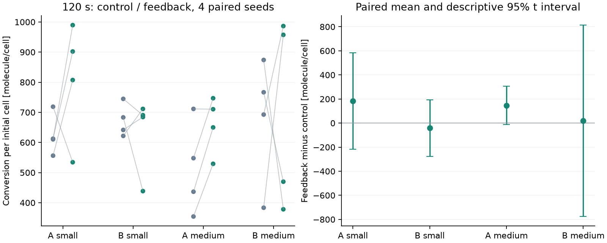

# 第一版验收记录

2026-10-05补充：[中心底物诊断同步记录](center-diagnosis-2026-10-05.md) 已补入酶释放扫描、80条A/B适应测试及54条三参数组合记录的审阅。接触方向转换、恢复判据及控制比较存在缺项；保留PTS与适应，后续小实验串行。本次同步没有增加运行验收成绩。

2026-10-04。用户要求提交目前完成的结果，后续由别人接手。本记录区分已验证能力和未完成的发布门槛，不把本轮提交称为全部 G1–G9 通过。

| 门槛 | 实际状态与证据 |
| --- | --- |
| G1 单一执行规范 | 自动检查通过。唯一正式 modular registry/runner；旧输入拒绝；[capabilities](evidence/capabilities.json)、模块去向和删除清单已保存。 |
| G2 模块复用 | 同一合同下的 A/B/MCP、机制替换、平台生长/事件测试通过。普通模块与来源模块不依赖旧注册链。 |
| G3 科学与数值 | PTS 容量与摄取、MCP 隐式方程、扩散与几何检查通过；主研究场景 dt/dx 敏感性尚未运行。 |
| G4 库存与事务 | 微量 accepted 与可表示场扣除、闲置场 bit 保持、有限库存、守恒/非负及物理过程后的失败回滚测试通过。 |
| G5 保存恢复 | 同版本连续/恢复、RNG、ledger、观测历史、稀疏输出和真实 Task 暂停/续算测试通过。旧 checkpoint 不迁移。 |
| G6 研究复现 | 中心 4 seeds × A/B × 小/中域 × 反馈/对照 × 120 s 已完成。芯片已改为沿 X 轴短边，旧 Y 轴数据及其衍生制品移出本次提交；当前芯片长时研究及最终 wheel 下所有指标的脚本/Task/UI 全量核对尚未完成。 |
| G7 使用与制品 | wheel 隔离安装与一步求解通过；细胞显示和 Task 0.6 导出/重开做过浏览器操作检查。当前 X 轴芯片的原生包/Wiki 全流程、非作者记录和完整 Design UI 批量运行/比较/导出尚缺。 |
| G8 壁钟可用 | 尚未完成三次串行端到端测量。研究扫描的单 run 时间受并行测试/其他扫描影响，不能作为 G8 成绩；没有核验 10 分钟目标或 UI 峰值内存。 |
| G9 描述真实 | 当前指南、支持矩阵、参数出处、科学近似与模块检查状态已更新；未验证数值标为 assumed，未核对模块标为 unreviewed。 |

## 软件与 UI 证据

`python -m pytest -q tests --basetemp runs/pytest-release --junitxml runs/P4-python.xml --tb=short`：531 passed、107 subtests passed、3 CUDA 硬件 skip，445.37 s。一个重复 ZIP 成员警告来自恶意包路径测试。[完整日志](evidence/python-tests.txt)、[JUnit XML](evidence/python-tests.xml)。

`node --test tests/*.test.mjs`：67 passed、0 skipped。[完整日志](evidence/node-tests.txt)。fake-indexeddb 在开发环境中实际安装，持久回放测试未因缺依赖跳过。依赖版本见[dependencies.txt](evidence/dependencies.txt)。

芯片方向更正后，`test_first_release_contracts.py`、`test_observations.py`、`test_first_release_science.py`：37 passed。核对 builder 和安装预设的 X 向初始场、有限交换边界、推进后的 Y/Z 一致性、沿 X 平均位置及高浓度区域占比；[JUnit XML](evidence/chip-x-axis-tests.xml)。上述全套 Python 测试在本次方向更正前完成。

细胞全景增加最小 4 px 位置标记，放大后保留真实几何；可选择菌体并 Focus cell。浏览器操作检查覆盖桌面 1440×1000、手机竖屏 390×844、横屏 844×390、平板 820×1180。没有实体触屏实测。旧 Y 轴运行所生成的截图、数据、回放包及 Wiki 已移至仓库外的“chip-y-待删除”文件夹，交由用户删除。

## 研究结果与界限

当前芯片的 300 s 终点分布及 10–120 s 漂移尚待重跑，不保留旧 Y 轴方向的研究数值。

中心案例的按初始细胞数归一化降解差（反馈减对照，molecule/cell）如下，统计单位是 4 对 run：

| 场景 | 均值差 | 描述性 95% t 区间 |
| --- | ---: | --- |
| A 小域 | 183.85 | [-216.00, 583.70] |
| B 小域 | -41.67 | [-277.26, 193.92] |
| A 中域 | 146.61 | [-12.05, 305.28] |
| B 中域 | 18.75 | [-775.96, 813.46] |

这些区间均跨过零，没有形成稳定降解收益的证据。seed 较少、dt/dx 尚未检查，区间描述本组探索性模拟，不支持实验收益或完整来源模型的结论。图中灰色为匹配对照，绿色为反馈；连接线配对相同 seed。

[中心 CSV](evidence/center-runs.csv)、[配对效应](evidence/center-paired-effects.csv)、[完整输入/逐秒序列/末帧/ledger](evidence/center-raw.zip) 已保存。研究运行时处于开发工作区，不能假称全部由最终 wheel 完成。

数值参数没有为提速更改。芯片的 Ki/Ka、cluster size 和速度尚无可核对的精确原始出处，仍保留数值并标 assumed。完整方程与省略机制见[science.md](science.md)。
