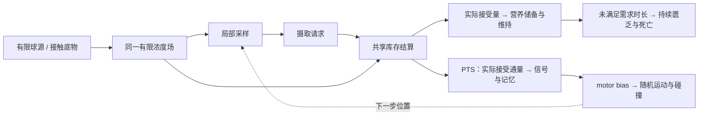

# 模块使用指南

更新：2026-10-02。本页介绍当前 `chemotaxis-spatial-v1` 真正注册并执行的 **28 个模块 ID、30 个版本条目**；MCP 与面积分裂分别保留 v1、v2。基础过程与 PTS/MCP 特殊信号可以组合，参数和连接均保存在普通 Workflow 图中。

阅读顺序：[选一个完整案例](#选一个完整案例) → [看懂组合](#看懂组合) → [找到要改的参数](#找到要改的参数) → [模块目录](#模块目录) → [随机数与生命周期](#随机数与生命周期)。公式、状态归属和科学限制见[基础组合说明](science/foundation-composition.md)与[N3机制说明](science/n3-mechanisms.md)。

## 所有机制的三层关系

“系统 → 基础模块 → 特殊模块”适用于所有机制。系统规定可控指标、单位、状态归属、资源结算、几何约束和提交规则；基础模块提供简单、可复用的行为；特殊模块提供某个来源模型的公式或组合。这里表示职责与复用关系，不要求每个特殊模块继承一个基础模块类，也不意味着三个独立物理过程都要同时运行。

下面记录当前已存在的实现。路径从仓库根目录起算。表中的 profile 简写：**legacy**=`legacy-explicit-v1`，**bulk**=`conservative-pts-bulk-v1`，**spatial**=`spatial-unbiased-v1`，**chemotaxis**=`chemotaxis-spatial-v1`；它们由 `engine/profiles.py` 选择不同注册库。

| 机制 | 系统职责与真实代码位置（均位于 `src/friskoli_cad/`） | 已注册的基础行为与特殊机制 | 当前执行边界 |
| --- | --- | --- | --- |
| 场 | `engine/local_fields.py` 管理有限场库存、扩散步长、物质账及提交；`engine/field_backend.py` 执行同一离散算子；`engine/spatial_runtime.py` 编排空间步骤 | 基础：`field.diffusive_local`、`source.finite_local`、`field.sample_local`；特殊场假设：`field.ideal_local_reservoir`；接触释放：`reaction.contact_degradation`、`reaction.direct_bulk_hydrolysis` | 前三个在 spatial/chemotaxis；恒定局部背景与 direct-bulk 在 chemotaxis。legacy 的 `field.diffusion_no_flux`、`field.ideal_reservoir` 经 `engine/modules.py` 执行，不能直接视作新profile同名接口 |
| 运动 | `engine/random_streams.py` 管理独立随机流；`engine/collision.py` 检查胶囊接触；`engine/hazard_walk.py` 与 `engine/random_walk.py` 实现各自事件推进；runtime 提交位置 | 基础：`motion.unbiased_run_tumble`；趋化组合：`motion.hazard_run_tumble` 读取模块提供的 motor bias，转角与 dwell 显式配置。legacy 另有 `motion.periodic_turn`、`motion.reflective_run` | 无偏模块在 spatial；chemotaxis 用 `signal.constant_bias` + hazard 运动构成无趋化对照，不同时执行两套运动。legacy 模块保持独立路径 |
| 摄取 | `engine/settlement.py` 负责共享库存的比例额度；`engine/local_fields.py` 约束可表示的实际场扣减；`engine/chemotaxis_runtime.py` 只把 accepted amount/flux 交给下游 | 基础：`uptake.saturating_request`；特殊：`uptake.pts_request` 接 `pts.capacity_rebuilt` 或 `pts.capacity_simplified`；结算节点：`uptake.local_settlement`、`uptake.bulk_settlement`。legacy 另有 `uptake.linear` | 通用饱和请求在 chemotaxis；PTS 请求可用于 bulk/spatial/chemotaxis，各自连接匹配的结算 owner；legacy 线性摄取不自动取得新结算语义 |
| 生长 | `engine/growth_system.py` 把理想营养增长实现为可表示胶囊几何和实际用量；`engine/chemotaxis_runtime.py` 做碰撞准入、库存与事务提交；公式位于 `science/physiology.py` | 基础简单模块：`growth.linear_elongation`；通用营养产率方程：`growth.nutrient_yield`，简化版采用其参数化；来源特化：`growth.nutrient_monod`，增加重建版胞内 Monod 项 | 线性伸长目前只在 legacy，未迁入 chemotaxis。新增长系统服务 chemotaxis 的两个营养增长模块；不声称历史增长路径已全部迁移 |
| 死亡 | `engine/chemotaxis_runtime.py` 根据声明的 hazard 抽样、记录死亡原因、移除存活实体并结算残余；RNG 与 checkpoint 共同保存状态 | 基础生存组合：`metabolism.reserve_balance` + `life.starvation_hazard`，公式在 `science/survival.py`；来源模型：`life.health_balance` 的 rebuilt/simplified policy，公式在 `science/physiology.py` | 这些模块均在 chemotaxis；每组只能有一个死亡 owner。资源上限或数值失败不转换为生物死亡；基础匮乏死亡不代表原 A/B 健康公式 |
| 信号 | `engine/compiler.py` 校验端口/依赖；`engine/profiles.py` 和 `engine/chemotaxis_runtime.py` 明确 same-step/previous-step 时序与状态提交；`science/pts.py`、`science/chemotaxis.py` 提供公式 | 基础固定输出：`signal.constant_bias`；特殊：`signal.pts_accepted`、`signal.concentration_memory`、`signal.chey_memory`、`signal.mcp_adaptation` | PTS accepted-flux 信号用于 bulk/spatial/chemotaxis；固定bias、memory、MCP 在 chemotaxis。固定bias可关闭信号对运动的反馈，不关闭摄取和生理 |
| 观测 | `engine/observations.py` 统一计算所有组的 cohort、区域与径向统计；`engine/chemotaxis_checkpoint.py` 保存历史；`registry.py` 发布 `catalog.observations` 的 ID、单位和定义 | 基础：`initial_count`、`live_count`、box/axis 指标；可配置扩展：`radial-spheres@1` 系统规则，发布 `radial.*` 指标 ID | 当前是 chemotaxis 的系统观测配置，不是普通 graph 模块节点。没有单独的“PTS 专属观测模块”；中心与半径适用于所有组 |

这张表不是已完成的统一插件 SDK 声明。当前注册库确实保存模块 manifest、版本、端口与可调参数，但多个 profile 仍按已知模块 ID 编排和分派；任意新增一个 manifest 并不能保证取得执行支持。系统职责已明确的部分、已注册模块以及尚未统一的调度边界，需要分别判断。后续扩展应继续沿三层关系整理，不为单个验收案例新增隐藏执行路径。

## PTS 重建版与简化版的来源

界面采用 **“PTS 重建版”** 和 **“PTS 简化版”** 两个名称；当前内部 A/B ID 为兼容已有图、任务与 checkpoint 保留，不改名。它们表示两套来源模型，不表示运行先后、质量等级或对照组。

| 当前内部名称 | 界面名称 | 可追溯来源与主要差异 |
| --- | --- | --- |
| PTS A / `rebuilt` | PTS 重建版 | 来源是 `D:/Wu Shangru/Documents/iGEM/model-A-rebuilt-v2`；审查副本为相邻仓库 `friskoli-model-review/rebuilt-v2`。使用膜面积/footprint 容量、浓度记忆和重建版生理规则；该源版本本身没有分裂。详见[重建版来源审查](science/source-models/rebuilt-v2.md) |
| PTS B / `simplified` | PTS 简化版 | 来源是队友提供的 `model.v4_simplified_v1_3(1).zip`；审查副本为 `friskoli-model-review/simplified-v4`。使用参考面积/Gcap 容量、CheY-P memory、有限 tumble dwell、yield-limited 生长及面积分裂。详见[简化版来源审查](science/source-models/simplified-v4.md) |

不能把“重建版”直接称为所有历史版本的原模型：它自己也是一个重建版本。两份原始来源与审查修订副本也不完全相同，已锁定代码来源见 [n3_source_lock.json](../src/friskoli_cad/science/data/n3_source_lock.json)。CAD 迁入了选定公式与机制，并采用自身的库存结算、碰撞与数值提交规则；其中原 A 的 contact/surface/bulk 三池按当前项目要求改为同一个可溶场。因此现在的 CAD 组合不是两份原始程序的逐轨迹复刻。

`foundation-pts-a/b` 在来源信号上组合了新基础 reserve/starvation 生存，不能称为原始 A/B 完整生命周期。`n5-b-lifecycle-128um` 则使用简化版生物参数和完整生长/表达/健康/分裂链，空间域、中心可溶源与对照布局是新构造场景。来源代码参数、构造场景参数和实验标定数值始终分开注明。

## 选一个完整案例

第一次使用先打开 **`foundation-control`**。它保留场、摄取、营养生存、随机运动和碰撞，便于先看清基础过程，再比较趋化信号带来的差异。

| 模板 ID | 适合观察什么 | 与基础对照的主要区别 |
| --- | --- | --- |
| `foundation-control` | 有限球源释放、扩散、通用摄取和随机游走 | motor bias 固定；仍然会消耗储备并在持续匮乏后出现死亡风险 |
| `foundation-pts-a` | PTS 接受通量与重建版浓度记忆 | 使用重建版容量、PTS 信号和浓度记忆，改变 run/tumble 概率 |
| `foundation-pts-b` | PTS 接受通量与简化版 CheY-P 记忆 | 使用简化版容量、CheY memory 与有限 tumble 停留 |
| `foundation-mcp` | 对独立 ligand 的 MCP 感知与适应 | ligand 不被摄取；另外的 nutrient 场均匀、持续补给，供通用摄取和生存 |
| `foundation-materials` | 接触酶降解如何自然形成可摄取的场 | 有限实体底物、表面酶和直接释放机制；产物进入同一个 PTS nutrient 场 |

这五套都显式包含 `nutrient_reserve` 与 `survival` 节点。非 MCP 案例初始 nutrient 为零、没有人为预置梯度，随后由来源/底物释放和扩散形成分布。完整 PTS 案例的初始信号按零摄取稳态设置。

原六套 `chemotaxis-pts-a/b/mcp/control/materials/lifecycle` 继续保留，适合检查最小信号链或来源生理模型。前五套原案例没有暗加新死亡；原 `chemotaxis-lifecycle` 使用另一套增长、表达、health 和分裂机制。新手需要基础营养生存时，应选上表的 `foundation-*`。

## 看懂组合

基础对照把图中的信号链换成 `signal.constant_bias`。MCP 则从**独立 ligand 场**采样并进入 `signal.mcp_adaptation`；其 nutrient 摄取链不作为 MCP 感知输入。MCP 模板的均匀补给是明确场景假设，并不表示所有 MCP 生物体系都有无限养分。

一个具有基础营养生存的完整案例需要：菌体几何与位置、一个养分场、位置采样、摄取请求、实际结算、储备与生存、偏置输入和运动。有限来源可以替代初始场库存，实体底物还需要降解提供者与显式酶。没有额外来源时，有限初始库存也能形成合法运行。

**放来源不等于已经完成摄取链。** 来源按 `species` 找到对应场；之后还需扩散、采样、摄取请求和结算。来源与场通过注册的物种关联，不需要给每个来源画一条直接连到场的端口边。

**放底物会声明并创建必需的降解机制。** 必需提供者受删除约束；具体由当前 Catalog 的对象声明决定，检查其节点即可确认。降解还要求对应菌群有显式 `surface.enzyme_activity` 或 `expression.surface_copies`。无酶、无接触或底物耗尽均不释放产物。只放一个底物盒子不会自动赋予菌体酶活性。

## 找到要改的参数

在 Space 选择菌群或环境对象查看其属性；在 Workflow 选择具体节点查看参数、端口、数学式与来源。**显示名称帮助阅读，完整 ID 和版本决定实际模块。** 节点 ID（如 `motility`）是案例中的实例名，同一模块可用于不同菌群。

| 要改变的内容 | 案例中的位置 | 参数与单位 |
| --- | --- | --- |
| 菌体大小、初始位置/方向 | 菌群几何与放置属性；`cell_area` 只读面积 | 总长、直径、坐标：µm；总长包含两端 |
| run 速度 | `motility` → `motion.hazard_run_tumble` | `speed_um_s`：µm/s |
| 转向频率与停留 | 同上 | `minimum_tumble_rate_s`、`maximum_tumble_rate_s`：1/s；`tumble_mode`、`tumble_duration_s`：s；`turn_kernel` |
| 物理域和网格 | 项目 domain 设置 | `counts_xyz` 与 `spacing_um_xyz`；域边长=格数×格距，格距单位 µm |
| 初始浓度 | 项目 species | `initial_concentration`：µM；登记物种本身不会产生摄取或反应 |
| 扩散与初始梯度 | `nutrient_field` / `ligand_field` | `diffusivity_um2_s`：µm²/s；`gradient_*_um_per_um`：µM/µm，仅初始化 |
| 球源位置、范围、供给 | `nutrient_source` 或 `attractant` | `center_*_um`、`radius_um`：µm；`initial_molecules`：当量；`release_rate`：当量/s |
| 底物库存和接触降解 | `substrate`、`degradation`、`surface_enzyme` | 库存：当量；`kcat_s`：1/s；`contact_range_um`：µm；酶：copy，以 molecule 表示 |
| 通用摄取能力 | `uptake_request` → `uptake.saturating_request` | `maximum_flux_molecules_s`：当量/s；`half_saturation_um`：µM，须>0 |
| PTS 摄取能力 | `capacity` 与 `uptake_request` | 先调容量模型的 copies/面积参数，再调 `turnover_s`：1/s 与半饱和浓度；不通过 EI 参数代替摄取能力 |
| 营养储备和维持需求 | `nutrient_reserve` | `initial_molecules`：当量；`maintenance_molecules_s`：当量/s |
| 匮乏多久后有死亡风险 | `survival` | `grace_s`：s，须>0；`recovery_rate`：恢复的匮乏秒数/供养秒数；`death_rate_per_min`：1/min |
| 无趋化对照 | `motor_signal` → `signal.constant_bias` | `bias`：0–1；保持其余环境、运动、摄取、初始条件和 seed 一致才便于比较 |
| 可重复随机实现 | 项目/运行 seed | 同输入、seed 与实现版本可重现；保存帧间隔不会重抽随机事件 |

当前演示菌体总长2 µm、直径0.8 µm、run速度5 µm/s、XY格距10 µm，均为 constructed。网格可以比菌体粗，但需要针对观察量做 dt/dx 比较；调格距时同时检查物理域是否被意外改变。未建立通用“推荐格距”，也不能靠增大时间步来证明长时模拟正确。

默认新储备100当量、维持10当量/s；外界完全无摄取时约先消耗10秒储备，再经历60秒匮乏宽限，之后才以构造的0.1/min hazard 产生风险。宽限期结束不会立即全死。重新供养逐渐降低匮乏状态；health 只是 `exp(-匮乏时间/宽限时间)` 的显示读数，没有实测健康量映射。

## 模块目录

下列端口按“主要输入 → 主要输出”简写；`1` 表示无量纲。物质的 `molecule` 在本模型中追踪可用营养/产物当量，不能据此声称完整碳或能量守恒。端口同单位也不一定可连接，物种、quantity、菌群 owner 和步时序都要匹配。

### 空间、场与物质来源：10 个 ID

| 名称 / ID | 主要输入 → 输出（单位） | 用途 |
| --- | --- | --- |
| 菌体表面积 `pts.capsule_area` | 菌体胶囊几何 → `surface_area`（µm²） | 历史 ID 带 pts；该读取本身不启用 PTS 感知 |
| 实体障碍物 `space.axis_aligned_obstacle` | 盒体边界（µm）→ `volume`（µm³） | 胶囊碰撞与场的不透通量边界；盒边需与网格对齐 |
| 有限局部来源 `source.finite_local` | 物种、球形范围、释放设定 → `inventory`（molecule） | 有限可溶来源，耗尽停止，不声称聚合物水解 |
| 可降解实体底物 `material.degradable_box` | 物种、盒体、初始当量 → `inventory`（molecule） | 固体库存与碰撞体；部分降解仍保留盒边，耗尽后移除掩膜 |
| 接触酶降解 `reaction.contact_degradation` | 注册材料/接触/酶 → `released_amount`（molecule） | 按接触酶预算释放，受剩余材料限制 |
| 直接产物释放 `reaction.direct_bulk_hydrolysis` | 注册材料/接触/酶 → `released_amount`（molecule） | 在接触酶预算上乘剩余量/初始量；与上一模块作为提供者替换使用 |
| 表面酶活性 `surface.enzyme_activity` | 显式 copies 参数 → `enzyme_copies`（molecule） | 恒定酶量，无表达或 turnover 动态 |
| 局部扩散场 `field.diffusive_local@2.0.0` | 初始场及同物种来源/扣除 → `concentration`（µM） | 一个有限场完成释放、扩散、共享摄取，无三池配额 |
| 恒定营养背景 `field.ideal_local_reservoir` | 物种初始浓度设定 → 场（µM）、累计补给（molecule） | 持续维持均匀养分；同物种不能再挂有限源/材料 |
| 局部浓度与梯度 `field.sample_local` | 场（µM）、位置（µm）→ 浓度（µM）、梯度（µM/µm） | 步初最近体素采样；不能把梯度读数直接当作已验证趋化 |

### 摄取与库存结算：5 个 ID

| 名称 / ID | 主要输入 → 输出（单位） | 用途 |
| --- | --- | --- |
| PTS 容量·重建版 `pts.capacity_rebuilt` | 表面积（µm²）→ functional copies（molecule）、增益（1） | 来源 A 的面积占用上限 |
| PTS 容量·简化版 `pts.capacity_simplified` | 表面积（µm²）→ 同上 | 来源 B 的参考面积/表达上限；与 A 不可视为同一参数化 |
| PTS 摄取请求 `uptake.pts_request` | 浓度（µM）、copies → `requested_flux`（molecule/s） | 总 copies × turnover × 饱和比例 |
| 通用饱和摄取 `uptake.saturating_request` | 浓度（µM）→ `requested_flux`（molecule/s） | `Jmax·C/(K+C)`；无需 PTS 容量或 EI |
| 局部共享摄取 `uptake.local_settlement` | 同一个场、请求 → `accepted_amount`（molecule）、`accepted_flux`（molecule/s）、累计量 | 真正扣除库存；累计量是统计，不是另一份储备 |

### 特殊信号与运动：6 个 ID

| 名称 / ID | 主要输入 → 输出（单位） | 用途 |
| --- | --- | --- |
| PTS 接受通量信号 `signal.pts_accepted` | `accepted_flux`（molecule/s）→ EI比例（1）、CheA/CheY（µM）、motor bias（1） | 降阶 PTS 信号；请求量不能替代接受通量 |
| 浓度记忆·重建版 `signal.concentration_memory` | 浓度（µM）、PTS bias（1）→ memory（µM）、motor bias（1） | 来源 A 的浓度低通与指数调制 |
| CheY-P 记忆·简化版 `signal.chey_memory` | CheY-P（µM）→ memory、有效CheY（µM）、motor bias（1） | 来源 B 的信号低通适应 |
| MCP 受体适应 `signal.mcp_adaptation@2.0.0` | 独立 ligand 浓度（µM）→ activity、methylation（1）、CheY（µM）、bias（1） | reduced MWC与适应；v1仅为兼容旧图，四个EI参数对MCP无效，新图选v2 |
| 无趋化对照 `signal.constant_bias` | 固定参数 → motor bias（1） | 关闭感知对运动的反馈，不关闭摄取、生存或随机性 |
| 信号驱动游走 `motion.hazard_run_tumble` | 已提交 bias（1）→ 位置（µm）、朝向、turn计数、碰撞/时钟读数 | hazard抽样、转角、可选dwell与胶囊碰撞 |

### 生存、增长与分裂：7 个 ID

增长按“系统 → 基础模块 → 模型模块”区分职责。**系统层**负责把模块提出的增长指标转成可表示的胶囊几何、检查碰撞、提交实际增长量与营养账，并在失败时回滚；系统不选择 A/B 生物公式。**基础简单增长模块**是 `growth.linear_elongation@1.0.0`，按 `elongation_rate`（µm/s）让长度线性增加、直径不变。它目前只在 `legacy-explicit-v1` 执行，未迁入 `chemotaxis-spatial-v1`，因此不计入本页28个新profile模块 ID。**模型增长模块**在新profile中声明营养驱动的理想体积增量，交给统一增长系统提交。

`growth.nutrient_yield` 的最大速率与产率限制是可复用的通用方程；原 B 选用它，并提供自己的参数，不能将该公式称为 PTS 独有。`growth.nutrient_monod` 额外使用原 A 的胞内浓度 Monod 项。两者都不自行绕过系统的几何、守恒或碰撞检查。基础线性模块的旧执行路径保持其明确的 profile 边界，当前不声称所有历史 profile 已统一迁移。

| 名称 / ID | 主要输入 → 输出（单位） | 用途 |
| --- | --- | --- |
| 营养储备与维持 `metabolism.reserve_balance` | 实际接受量（molecule）→ 储备、已用量（molecule）、未满足时长（s） | 新基础库存，含数值补偿状态保留极小摄取 |
| 持续匮乏生存 `life.starvation_hazard` | 未满足时长（s）→ 匮乏状态（s）、health（1）、等效hazard（1/min） | 新基础死亡；不要求增长/表达/PTS |
| 营养生长·重建版 Monod `growth.nutrient_monod` | 接受量（molecule）→ 库存、已用量、体积（µm³）、实际增长率（1/min） | 胞内浓度Monod与产率限制；几何受阻不消费增长养分 |
| 通用营养产率限制（简化版采用） `growth.nutrient_yield` | 同上 | 来源 B 的最大生长/产率限制，不含 A 的 Monod 项 |
| 表面表达 `expression.surface_copies` | 实际增长率、已提交health、面积 → 总 `enzyme_copies`（molecule） | simplified恒合成或rebuilt反馈；真实turnover，增长不重复扣总copies |
| 健康与死亡 `life.health_balance` | 增长率、载体/酶copies、面积 → health（1）、hazard（1/min） | 来源 A/B 的修复、负担、匮乏假设，与新基础死亡是替代模型 |
| 面积 adder 分裂 `division.area_adder` | 增长模块体积（µm³）→ 分裂/受阻（1）、出生面积（µm²） | 达面积阈值后检查空间与最小子代尺寸，按体积分数分配 |

分裂 v1 使用固定 `added_area_um2` 与 `[minimum_fraction, maximum_fraction]` 内均匀分割。v2 使用原 B 的每周期 folded Normal 面积阈值，增加输出/状态 `required_area`；参数为 `target_volume_um3`（µm³）、`area_cv`（1）、`minimum_area_um2`（µm²）、`split_mean`、`split_sd`、`minimum_fraction`、`maximum_fraction`（均为1）。默认值分别为1、0.15、1e-6、0.5、0.05、0.35、0.65。原B完整参数的独立中心源案例与局限见 [N5 B 生命周期](science/n5-b-lifecycle.md)。

## 随机数与生命周期

信号 ODE、memory 和 Hill motor bias 给定输入后是确定性的；运动根据 bias 得到 hazard，再抽事件时间和方向。RNG 服务按 seed、节点、菌群、稳定 cell ID 和用途建立独立流：`run_hazard`、`tumble_direction`、`death`、`division_fraction`、分裂 v2 的 `division_threshold`。不存在一个可以随意接给所有菌体的共享随机数输入。相同 seed 能重现随机过程，不意味着轨迹没有随机性。

**每份 accepted amount 只能进入一个胞内库存 owner。** 同一菌群的 `metabolism.reserve_balance` 不能再与 `growth.nutrient_monod/yield` 并用，preflight 会拒绝；也不能同时挂两种死亡 owner。新基础生存用于不依赖增长的探索，旧生命周期图用于来源增长/表达/health/分裂链。目前没有通用的“维持与增长共享库存分配”模块，不能靠复制连线得到它。

分裂只在显式添加 `division.area_adder` 并连接增长 owner 后发生。储备、体积和总 copies 等数量按份额分配，信号强度/记忆等状态按声明继承；受阻分裂会延后，不制造死亡。死亡移除活菌碰撞体，并把剩余可用营养记入 removed-residual 账，不自动回流到外场。

checkpoint 保存库存、动态信号、生命周期、事件时钟与 RNG，恢复要求输入和实现锁一致；输出帧可以稀疏保存，数值积分步仍逐步执行。详见[checkpoint说明](checkpoint-files.md)。

## 公式、出处和当前限制

所有演示值均为探索性 constructed 或来源代码的 source-derived；两者都不等于本构建体实验标定。新基础维持/匮乏模型明确是 phenomenological，尚无真实菌株的参数拟合。MCP 的受体结构、PTS 信号、motor关系及适应近似，各自的论文支持范围和删减项见[N3机制与文献](science/n3-mechanisms.md)；新储备和死亡的公式、官方单位/概率来源及验证见[基础组合说明](science/foundation-composition.md)。

一次有方向的轨迹、源附近菌数增加或可见死亡都不能单独证明趋化性能、真实代谢或实验存活规律。比较应保留同环境、初值与seed，对照恒bias/反向梯度，并检查步长与网格敏感性。当前已有证据和未显示明确增益的结果均保留在[多seed比较](science/n3-comparison.md)；12小时生物预测尚未被这些短程测试验证。
