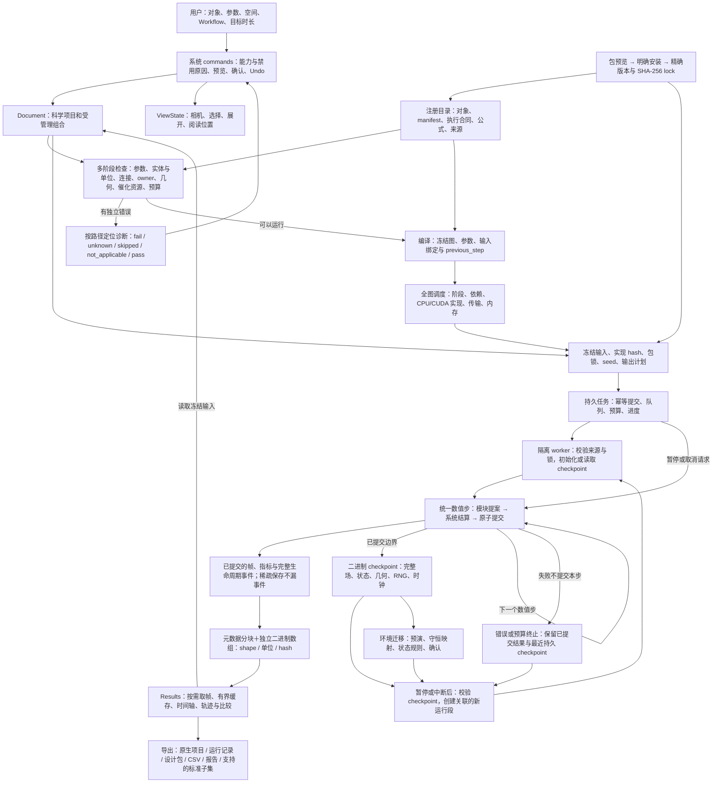
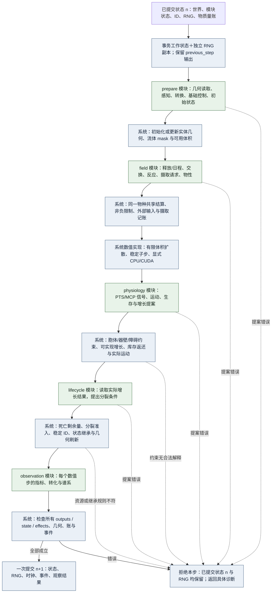

# 系统运行结构

适用：`modular-spatial-v1`，Project 0.6、Module/Graph 0.2、Catalog 0.5、Task 0.6、Workspace 0.7。旧 profile 执行器已删除。实施与验证状态见[当前支持矩阵](first-release/support.md)；本图描述可执行职责，不把物理时长验证当成实验标定。

只有两种可执行形式：**系统机制**与**注册模块**。基础模块、PTS/MCP 等特殊模块共用同一个入口。对象库、参数包、底盘/元件和模板都是可编辑的组合数据，不拥有隐藏算法。系统也不根据案例名称决定计算路径。

## 完整用户流程与运行路径

ViewState 不进入科学输入 hash；正在编辑的 Document 不修改已经提交的运行。模板事务只改 Document。目录缓存允许离线阅读和编辑，重新求解需要本机内核以及项目锁要求的实现。

## 一个数值步内部

绿色节点是注册模块，蓝色节点是系统机制。模块通过 `initialize(StepContext)` 或 `propose(StepContext)` 返回 `ModuleProposal(outputs, state, effects)`。Context 中数组和映射只读；系统根据合同提供本阶段可读资源、明确的 entity sets 与执行 backend。模块不直接改世界对象或其他模块状态。每个阶段使用同一计划中的依赖顺序；跨阶段逆向的 same-step 边在编译时拒绝。previous-step 是明确的一步延迟，不自动解代数环。

实际摄入量、受限交换量和几何结算后的增长量通过 `settled_outputs` 声明。它们只允许后续阶段读取，或显式读取 previous-step；同阶段不能把尚未结算的提案当成实际结果。分裂模块在独立的 lifecycle 阶段读取已实现的体积，因此受器壁阻挡、尚未兑现的增长不能触发分裂。系统同时限制各 effect 的阶段，不接受错过结算时点的操作。没有相关 effect 的阶段不复制和重算整个场。

共享场和几何的检查、结算属于系统规则。具体速率、信号、存活函数、增长规律及观察公式属于模块。添加新的计算通常只需要注册模块；增加全新的共享状态种类或 effect 则需要扩展有版本的系统合同及对应验证。

系统允许碰撞导致的位移阻挡或增长受限，它们是正常结果；不会为了“成功运行”重复随机初始化、悄悄减少菌数或增大数值步长。迭代求解的稳定子步遵守声明的数值条件。异常时的事务回滚用于保持状态完整，不替代运行前规则。

## 模块合同与组合

| 内容 | 系统检查 | 模块负责 |
| --- | --- | --- |
| 身份 | namespace、ID、版本、包 hash、实现一致 | manifest、明确许可证和来源 |
| 端口 | shape、dtype、quantity、unit、实体集合/顺序、坐标/轴序、时间角色 | 方程需要的真实输入与输出 |
| 状态 | 唯一 owner、初始化、序列化、分裂/死亡/迁移策略 | 自己的状态与初值 |
| 副作用 | 授权 effect 与目标、共享结算、非负和几何约束 | 请求释放、摄取、运动、增长、死亡或观察 |
| 设备 | 已注册实现、真实分派、传输与预算 | CPU/CUDA 可执行实现，保持声明精度 |
| 证据 | 保存原始输入、版本、seed 与来源 | 公式、适用范围、参数证据、数值测试 |

当前事务协调器的数据位于主内存。CUDA 扩散使用明确的主机/设备往返，节点中的 CPU 实现继续在 CPU 上执行；没有把它描述成整个图永久驻留 GPU。任务层在计划的数组下限之外计入场缓冲、增长至声明菌数上限的状态、结构记录、32×N² bytes 碰撞工作区、模块声明的固定/逐格/逐菌工作区、输出及 checkpoint。非凸网格的几何计算使用有界向量分批，体素碰撞盒另计内存。每个结构记录端口/状态最多 1 MiB，不允许在一个 record 中无限累积历史。

显式安装的 Python 插件属于受信任代码。预览和安装只校验、复制文件；加载已安装且 hash 匹配的项目锁时才导入工厂。本接口限制模块的数据访问与提交形式，不宣称提供操作系统沙箱。

## 生命周期与时间

分裂由模块提出，系统检查几何并产生稳定的新 ID，按每项状态声明继承。默认分裂所需新增膜可获得，新增几何面积不冒充膜分子库存。受体、载体和表达拷贝数依自身状态规则继承，不随面积自动复制。死亡残余若通过显式残体模块释放，其来源须来自已记录的死亡剩余量。

`system_limits.max_cells` 是所有分裂模块共用的资源上限，默认 256，可在本机能力范围内显式设置。超限报告 `resource.cell_limit`，本步不提交并保存最后已提交状态；它不代表菌体发生生物学抑制。提高预算后可以预演迁移并继续。几何空间不足导致的增长/分裂受阻仍是正常模型结果。

物理时长、数值步长、保存间隔、播放速度和壁钟预算互相独立。12 h 是 43,200 s；若选择 `dt=0.01 s`，对应 4,320,000 个数值步。保存间隔可以降低 I/O，但不能减少中间科学计算或丢失生命周期事件。暂停只在已提交边界写 checkpoint；恢复及环境迁移保留原结果，并记录父运行、起始步和变更内容。

环境迁移须先预演。Project 0.6 可以选择固定原点与物理坐标的域扩缩：新增空间为零浓度，只允许裁掉零库存且不排除实体/来源的区域。场的浓度、每格物质量以及有明确定义的 vector/tensor 分量按局部体积交叠守恒映射；初始库存由保存的 origin 项目校验。需要旋转坐标、移动来源或把裁掉的物质算作外流时，必须另有对应映射和物质量账，当前会明确拒绝。

## 实现位置

| 责任 | 入口 |
| --- | --- |
| 执行接口、端口与 planner | `engine/module_api.py`、`engine/port_semantics.py`、`engine/execution_planner.py` |
| 多阶段诊断和包管理 | `diagnostics.py`、`packages.py` |
| 普通模块与统一运行器 | `engine/standard_modules.py`、`engine/science_extensions.py`、`engine/science_adapters.py`、`engine/science_advanced.py`、`engine/modular_runtime.py` |
| 数值纯函数 | `science/processes.py`、既有 `science/pts.py`、`science/chemotaxis.py`、`science/physiology.py` |
| 任务、数组、完整状态 | `tasks/service.py`、`tasks/worker.py`、`tasks/arrays.py`、`engine/task_checkpoint.py`、`engine/modular_checkpoint.py` |
| 工作区、命令与事务 | `web/commands.mjs`、`web/workspace-transactions.mjs`、`web/workspace-session.mjs`、`web/task-store.mjs` |

全部 73 个模块的名称、ID 和端口见[模块索引](module-reference.md)，科学说明与适用范围见[模块指南](module-guide.md)和[模块扩展说明](science/modular-processes.md)。未完成的外部标准、实验标定与实体设备验收继续单列在[剩余工作](archive/planning/remaining-work.md)。
