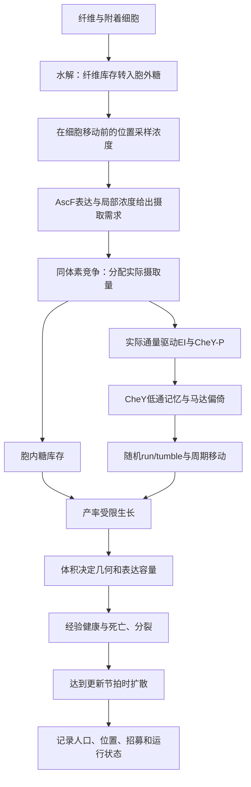

# simplified-v4：从摄糖信号到细胞群体行为

本页解释一个三维个体模型：细胞在周期空间中游动，靠近纤维时可能附着并水解纤维，摄取释放到环境的糖；摄糖信号改变运动，胞内库存支持生长与分裂。模型可以研究这些假设如何共同影响群体分布，尚不能给出经实验验证的最优表达量或工程菌性能预测。

审查日期为2026-09-29。来源是`model.v4_simplified_v1_3(1).zip`；原包与独立修订版的差异在文末列出。2026-10-01 更新：CAD N3 已注册 B 的 CheY-P 适应、生长、表达、health 与面积 adder，并采用 direct-bulk 接触释放；事件定位、几何和时间分拆有明确差异。当前运行见 [N3 Wiki](n3-chemotaxis.md)。下文继续解释来源版本。本页采用易读的符号，源代码中的S有时指糖浓度、有时指表面积，在这里分别写成c和A。

## 1. 一个时间步发生什么

下图是修订版`accepted-flux-periodic-v1`的顺序；扩散和纤维更新有较低的更新频率。原包先按摄取需求更新信号，实际库存稍后才结算，这一点已修正。

权威状态保存在`Simulation._batch_state`。常规`Bacterium.update`函数存在，但主仿真实际使用批量更新；理解源码时须沿`Simulation.step`读取。[源定位C01–C12见审查文档]

## 2. 状态、单位和边界

| 符号 | 含义 | 单位/范围 |
| --- | --- | --- |
| c | 胞外cellobiose浓度 | µM，三维体素场 |
| J_req、J | 摄取需求、实际跨膜通量 | molecule/(cell·s) |
| n、U | 胞内糖库存、一个时间步接受量 | molecule |
| e | EI去磷酸化分数 | 0至1 |
| Y、Y_m | CheY-P及其低通记忆 | µM |
| b | 马达偏倚的模型值 | 0至1 |
| V、A、r | 细胞体积、面积、固定半径 | µm³、µm²、µm |
| G、G_eff | 目标表达倍数、容量限制后有效倍数 | 无量纲 |
| N_INP | 单细胞有效展示拷贝数 | copy/cell |
| H | 经验健康状态 | 0至1，无实验量映射 |

信号和运动用秒，生长、表达与健康用分钟；程序以dt/60转换。默认空间为1000³µm，网格边长50µm，细胞步长0.01s，扩散更新间隔0.1s。这些是配置选择。场与运动采用周期边界：离开一侧会从另一侧进入。它不表示封闭容器的反射壁面，也不能直接套用CAD已有的no-flux扩散模块。

1µM·µm³对应602.214076个分子当量。该换算来自Avogadro精确常数及体积单位，不是生物参数拟合。[NIST SP330 section 2](https://www.nist.gov/pml/special-publication-330/sp-330-section-2)

## 3. 摄取和PTS信号

表达与糖浓度先决定需求：

\[
J_{req}=N_0G_{eff}k_{cat}\frac{c}{K_S+c}.
\]

同一体素里的细胞共享有限库存。若该体素库存为M，各细胞请求R_i=J_req,i dt，实际接受量为

\[
U_i=R_i\min\left(1,\frac{M}{\sum_jR_j}\right),\qquad J_i=U_i/dt.
\]

零请求单独处理。胞外扣去的量与胞内增加的量使用同一组U；细胞排列先后不决定优先权。修订版以实际J驱动简化PTS信号：

\[
\dot e=k_dJ(1-e)-k_re,\quad
A_P=A_T\frac{K_I}{K_I+E_Te},\quad
\dot Y=k_YA_P(Y_T-Y)-k_ZY.
\]

摄糖增加使e升高，模型中CheA活性A_P随之降低，再影响CheY-P。每一步先冻结J解析更新e，再冻结新的A_P解析更新Y；两个子方程有解析子步，整个耦合系统仍有时间分拆误差。

实验支持PTS网络传递整体糖influx信息，但这里省略了PEP、HPr、EIIA/B等显式状态。论文不直接提供本模型所有参数，也未证明这两条简化ODE可准确描述工程菌。[Somavanshi et al., 2016](https://journals.plos.org/plosbiology/article?id=10.1371/journal.pbio.2000074)

## 4. 适应与随机运动

程序让CheY记忆追随当前信号：

\[
Y_m'=Y_m e^{-dt/\tau_a}+Y'(1-e^{-dt/\tau_a}),\quad
Y_{mot}=\operatorname{clip}(Y_0+Y'-Y_m',0,Y_T).
\]

随后计算Hill响应和翻转概率：

\[
b=\frac{Y_{mot}^h}{K_M^h+Y_{mot}^h},\quad
\lambda=\lambda_{min}+(\lambda_{max}-\lambda_{min})b,\quad
p=1-e^{-\lambda dt}.
\]

恒定输入最终使Y_m接近Y，马达有效信号回到Y_0；这是低通结构带来的适应。程序没有显式MCP甲基化或CheR/CheB动力学。PTS趋化适应的生物证据涉及下游受体适应，不能据此把低通时间常数3s写成实验测定值。[Neumann et al., 2012](https://pmc.ncbi.nlm.nih.gov/articles/PMC3409764/)

细胞在run状态沿方向移动，在tumble开始时抽取新方向并停留固定时长。源码的转角是截断正态分布，方位角均匀；每步最多一个翻转开始。没有流体动力、旋转扩散、细胞碰撞或鞭毛束模型。单马达CheY-P/CW-bias的陡峭Hill响应有实验依据；把它线性映成整个细胞的tumble hazard是额外假设。[Cluzel et al., 2000，作者机构PDF](https://cluzel.fas.harvard.edu/sites/g/files/omnuum7156/files/cluzel/files/cluzel_science_00.pdf)

## 5. 纤维、黏附与水解

默认路线先按细胞中心到周期纤维线段的距离寻找候选，再随机决定附着或脱附。默认最终捕获距离约30µm，200µm是候选搜索距离，不能混为实际接触尺度。附着是一个离散状态，不代表程序求解了接触力。

一根纤维上附着细胞的有效展示酶数相加，给出E_f。每个纤维更新步的产物量为

\[
Q_f=\min\left(k_hE_f\frac{C_f}{C_{f,0}}dt_f,\ C_f\right).
\]

C_f是剩余纤维的cellobiose-equivalent库存。产物按各附着细胞INP拷贝比例沉积到它们所在的胞外体素，纤维库存减少相同当量。

原配置虽叫surface_pool，活跃路径实际上直接向bulk场释放，并令surface_S=0。旧表面池、泄漏、synergy与接触微区参数没有全部参与这条路径。这个名称不能作为已实现表面微环境的依据。

## 6. 生长、几何与分裂

糖先进入胞内库存n，再按最大增长率和产率限制使用：

\[
B=\min\left(n,\frac{\mu_{max}Vdt_m}{Y_V}\right),\quad
\Delta V=Y_VB,\quad n'=n-B,\quad \mu=\Delta V/(Vdt_m).
\]

其中dt_m=dt/60，Y_V单位µm³/molecule。没有维护代谢、氧限制或完整碳/能量结算；INP表达也没有扣除独立的合成物料。

细胞采用固定半径球柱体：

\[
V=\pi r^2\ell+\frac43\pi r^3,\qquad
A=\frac{2V}{r}+\frac43\pi r^2.
\]

源码length是中间圆柱段ℓ；CAD胶囊总长须用L=ℓ+2r，直径d=2r。默认surface-adder用固定参考表面积增量加噪声；r=0.4µm时平均ΔA=2.5µm²等价于ΔV=0.5µm³。达到阈值且母体能分成两个合法球柱体时，随机分配体积、胞内糖和INP，继承信号与健康状态。

这一固定半径adder与论文提出的表面/体积合成机制有概念联系，但并非同一套动力学。分裂新极会增加总面积，程序没有膜材料账，子代位置也没有碰撞处理。[Harris & Theriot, 2016](https://pubmed.ncbi.nlm.nih.gov/27259152/)

## 7. 表达容量、INP与健康

AscF目标数量N_0G受到面积相关容量限制：

\[
N_{fun}=\min(N_0G,N_0G_{cap}A/A_0),\quad G_{eff}=N_{fun}/N_0.
\]

负担指标φ用超出基础表达的目标量除以剩余容量，可以大于1。它不等于膜面积占用百分比；INP占比当前只作为诊断量，没有进入同一健康负担。

修订版明确INP状态N为总拷贝数，默认

\[
\dot N=k_{exp}f-k_{deg}N.
\]

纯体积增长降低N/V，不会自动减少N；分裂另按比例分配数量。原来的−µN保留为显式legacy_growth_loss政策，含义是额外生长相关丢失，不能再叫数量的体积稀释。这里做的是变量定义一致性修正，实际合成与周转常数仍未标定。[Lin & Amir, 2018](https://www.nature.com/articles/s41467-018-06714-z)

健康采用经验修复、负担和饥饿项，随后以低健康对应的hazard抽取死亡：

\[
\dot H=k_R(1-H)-k_B\phi-s_{max}\max(0,1-\mu/\mu_{max}).
\]

H没有经过测量映射；原健康参数部分按设计标准选择。因此模型中高G成本可能由假设预设，不能据此宣布G≈5–10或其他范围具有实验最优性。

## 8. 原包与审查修订版

原ZIP的SHA256为`a3900092cb03a9d686800ca3c9450a2ce09fd5470c921b416b5aae5d0b63a5c2`，独立原基线为`98b12ff`。修订代码在相邻`friskoli-model-review/simplified-v4`，版本`simplified-v4-reviewed-2026-09-29.1`。

| 项目 | 原包 | 修订版 |
| --- | --- | --- |
| 摄糖信号 | 用请求通量，即使局部不足 | 用实际接受量/dt，需求另外保留 |
| 扩散 | 连续波数FFT后裁负、重标；FD丢余时 | 默认离散七点FFT矩阵指数；FD覆盖完整请求 |
| 点源与全死场 | 热路径漏持续源；全死step不扩散 | 每步持续源、独立场时钟；run灭绝明确早停 |
| 分裂记忆 | batch同步和追加漏Y_mem | 母子继承与所有数组对齐经过真实分裂测试 |
| INP | 数量与浓度稀释含义混用 | 显式copy_number和legacy_growth_loss政策 |
| 资源上限 | 随机删细胞、记为死亡 | resource_limited停止并保留人口 |
| 死亡剩余糖 | 随清理丢失，无记录 | 一次转入移出账，不假定裂解回收 |
| 边界与时长 | 可能忽略边界配置、使用全局domain或超时 | 仅接受periodic、使用实例domain；拒绝非整倍时域，按整数步数运行 |

修订后已运行129项有限回归测试；其中新增26项另在真实Numba JIT下通过。覆盖Fourier模态、脉冲、质量与正性容差、实际摄取、死亡库存、真实分裂和运行终点。它们验证具体数学与程序性质，没有完成多尺度收敛、全部测试、全部物质账或实验验证。

新离散FFT不做全局裁负/重标，但浮点残差仍存在，库存比较必须用容差。原摄取末端仍有浮点裁零。纤维首步预付时间段、共享随机数流、普通adder几何门槛与无碰撞等局限保留，文档不将它们隐藏为已修复。

## 9. 在CAD里应怎样表达

建议把需求、库存结算、PTS、适应、运动、附着、水解、周期扩散、生长、表达、健康和分裂登记为独立数学模块或明确复合模块。胞内、胞外和纤维库存各有唯一结算责任；细胞身份与fiber/grid映射明确，避免多个模块重复写状态。

这些拆分已在 N3 按明确状态责任实现；当前执行合同、几何与源版本仍有差异，详见 [N3 科学说明](../../archive/science/n3-mechanisms.md)。源周期扩散不能无说明地换成 no-flux；胶囊总长也要经过转换。完整公式定位、参数证据强弱、测试与版本差异见[源模型审查](../../science/source-models/simplified-v4.md)，合同依据见[registry-contract](../../archive/legacy-protocols/registry-contract.md)。

## 10. 证据怎样读

本页区分三种支撑：源码证明程序实际做了什么；构造测试证明特定输入下的数学或程序性质；原始论文支持某些机制方向。三者不能互相替代。K_S=30µM等无直接测量来源的配置保持“待标定”，不补造文献依据。原asc operon研究支持AscF/AscB功能背景，未在本次材料中支持该K_S数值。[Hall & Xu, 1992](https://pubmed.ncbi.nlm.nih.gov/1630307/)

需要解读某次运行时，至少同时保存模型版本、diffusion_method、INP政策、随机种子、请求/实际时长与停止原因，再讨论轨迹或组间比较。
